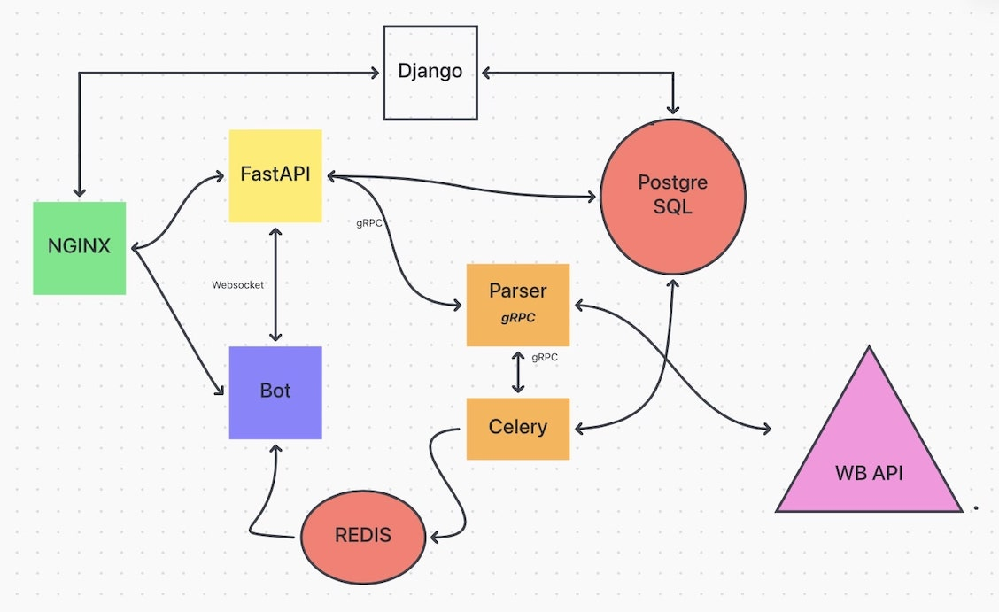

#
## Компоненты
- Веб-приложение на FastAPI  
- Веб-сервер Nginx  
- База данных Postgres  
- Телеграм-бот на Aiogram 3  
- Очередь задач Redis
- Сервер выполнения задач Celery
- gRPC сервер для парсинга
- Админ панель на Django

## Реализация

- **Контейнеризация**: Приложение развернуто в контейнерах, 
что обеспечивает изоляцию и упрощает управление зависимостями.
  
- **Безопасность**: Конфиденциальные данные хранятся в файле `.env`, 
что гарантирует защиту секретной информации и минимизирует риски утечек.

- **Документация**: Автоматически генерируемый **сайт с документацией**, созданный с помощью **MkDocs**, 
облегчает понимание и использование проекта, предоставляя разработчикам и пользователям доступ к актуальной информации.

- **Связь между ботом и сервером**: Реализована через **WebSockets**, 
что обеспечивает мгновенную передачу данных и высокую отзывчивость интерфейса.

- **Административная панель**: Развернута админка на **Django**, 
позволяющая удобно редактировать модели и управлять данными в приложении.

- **Проксирование запросов**: **Nginx** используется для проксирования запросов и отправки статических и медиа файлов Django.

- **Управление миграциями**: **Alembic** применяется для управления миграциями базы данных, 
что упрощает процесс обновления схемы и поддержания целостности данных.

- **Асинхронный драйвер**: Используется `asyncpg` для работы с PostgreSQL, 
что позволяет эффективно обрабатывать асинхронные запросы к базе данных.

- **Фоновая обработка**: **Celery** периодически проверяет цены на товары и сравнивает их с данными в базе. 
При изменении цены отправляет уведомления пользователю через **очередь Redis**. 
Бот реагирует на это сообщение и отправляет уведомление пользователю.

- **Telegram Бот** не имеет доступа к базе данных, а использует **сервер FastAPI**, 
и по сути является просто интерфейсом к **API**,

- **Парсинг данных**: FastAPI и Celery используют **gRPC сервер** для парсинга данных, 
- что позволяет эффективно обрабатывать запросы.

## Схема

